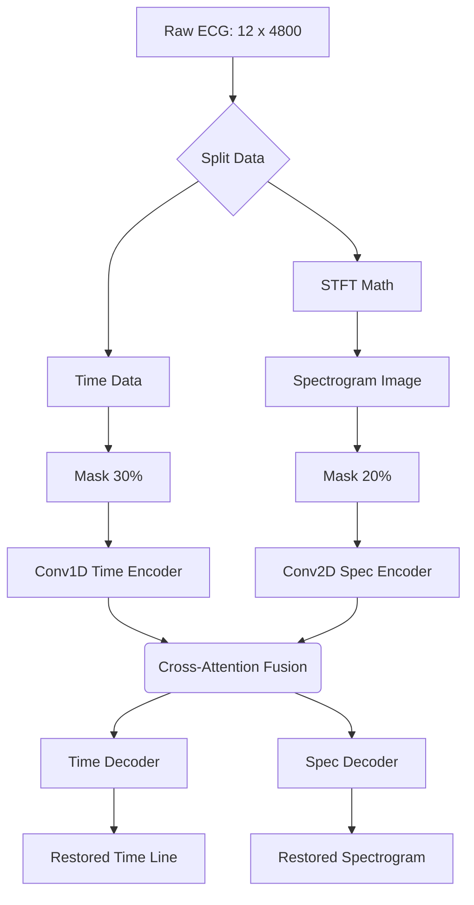

# 4. In-Depth Guide: The TSRNet Architecture

This document breaks down the actual neural network structure used in this project. You will find this code in `lib/TSRNet.py`. 

TSRNet stands for **Multimodal Time and Spectrogram Restoration Network**. That is a mouthful, but we can break it down into three simple concepts: **Multimodal (Two Brains)**, **Restoration (Masking)**, and **Cross-Attention (Talking to each other)**.

---

## Part 1: Multimodal (The Two Brains)

If a doctor looks at an ECG, they see a line moving up and down over time. Our AI has a "Time Brain" to do exactly that. 
However, AI is capable of looking at the same data in multiple ways at once. We give our AI a second brain called the "Spectrogram Brain" which looks at the *frequencies* (pitch and energy) of the heartbeat.

### The Time Branch (Brain 1)
When the `(12, 4800)` array (12 leads, 4800 time steps) enters the Time Branch, it passes through **1D Convolutional Neural Networks (Conv1D)**.
* **What is Conv1D?** Imagine sliding a tiny magnifying glass across the ECG line from left to right. The magnifying glass looks for local patterns, like the sharp spike of the QRS complex. 
* By stacking multiple Conv1D layers, the AI learns to identify the P-wave, QRS complex, and T-wave.

### The Spectrogram Branch (Brain 2)
Before the data enters the second brain, the code uses a math function called **STFT (Short-Time Fourier Transform)**. 
In our code, we set `nperseg=125`. 
* **What is STFT?** It takes the squiggly line and converts it into a colorful 2D heatmap image (a Spectrogram). 
* The X-axis is Time, the Y-axis is Frequency (speed of vibration), and the colors represent Energy (loudness).
* This allows the AI to see hidden, high-frequency anomalies that are invisible on a normal line graph!

Because the input is now a 2D image, the Spectrogram Branch uses **2D Convolutional layers (Conv2D)**, identical to the AI that powers facial recognition on your phone.

---

## Part 2: Restoration (The Masking Puzzle)

We covered in Document 2 that we train the AI by sabotaging the data and asking the AI to reconstruct it. Let's look at exactly how our code does this.

In `train.py`, we have two specific command-line arguments:
* `--mask_ratio_time=30`
* `--mask_ratio_spec=20`

### How the Masking Works:
1. **Time Masking (30%):** The code randomly selects 30% of the 4800 time steps. It deletes the actual voltage numbers and replaces them with a special `[MASK]` token (usually a zero or a random placeholder). The AI is now blind to 30% of the heartbeat.
2. **Spectrogram Masking (20%):** The code randomly blacks out 20% of the 2D spectrogram image. 

The AI is forced to pass this broken, masked data through its Encoders (Brains). It must then use **Decoders** (reverse convolutional layers) to draw the missing pieces perfectly. 

Because we only feed the AI perfectly healthy patients from the PTB-XL `NORM` class, the AI's internal weights (all 4.39 Million of them) adjust until it becomes a master at drawing healthy heartbeats.

---

## Part 3: Cross-Attention (The Brains Talking)

If you have two brains solving a puzzle, they need to communicate. If the Time Brain thinks it sees a missing QRS spike, it needs to ask the Spectrogram Brain if it sees a sudden burst of high-frequency energy at that exact same millisecond. 

Our code achieves this using a **Transformer Cross-Attention Module**.

### The Q, K, V Concept (Query, Key, Value)
Cross-Attention uses a system exactly like a search engine (like Google):
1. **Query (Q):** What I am looking for.
2. **Key (K):** What information is available.
3. **Value (V):** The actual data being returned.

**How it works in TSRNet:**
* The **Time Brain** generates a **Query**: *"I am looking at time step 500, and my data is masked. Spectrogram Brain, what do you have?"*
* The **Spectrogram Brain** exposes its **Keys** (its unmasked frequency data). 
* The Attention math calculates how strongly the Query matches the Key. If there is a strong match, the Spectrogram Brain passes its **Value** (the frequency data) over to the Time Brain.

By fusing the time data and frequency data together, TSRNet makes an incredibly educated, dual-modal prediction of what the masked heartbeat should look like!

### Architecture Flowchart



---

## The encoder gets a second job

The diffusion branch added on top of this project **reuses `Encoder1D`** - the same
Conv1D time encoder drawn above - instead of introducing a second architecture:

```
x_t [12 x 4800]  ->  Encoder1D  ->  z_t [50 x 136]
                                      + TimeEmbedding(t) [50]
                                      -> NoiseDecoder1D -> predicted noise [12 x 4800]
```

Two things to be clear about:

* It is a **separate instance with its own weights**. The TSR-Net checkpoints in
  `ckpt/` and the behaviour of `train.py` / `test.py` do not change at all.
* The head is `Decoder1D` **without the final `Tanh`**. TSR-Net restores a signal
  scaled to [-1, 1], so squashing the output makes sense there. Predicted noise is an
  unbounded Gaussian, so a `Tanh` would cap what the head can express.

Full details: [07_diffusion_noise_branch.md](07_diffusion_noise_branch.md).
